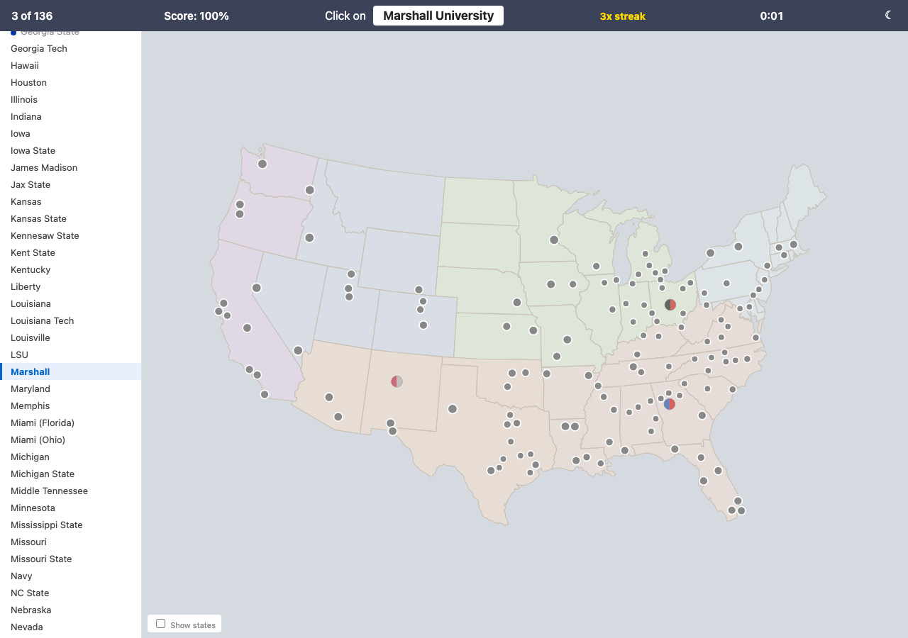
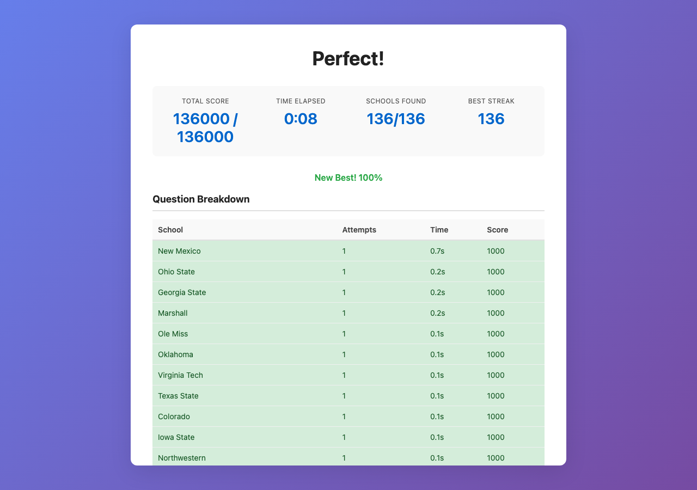

# NCAA School Find Game

A browser-based geography quiz that challenges players to locate all 361 NCAA Division I schools on a US map, with five difficulty tiers, timed scoring, and streak tracking.

## Documentation

- [docs/INSTALL.md](docs/INSTALL.md): Setup steps and prerequisites.
- [docs/USAGE.md](docs/USAGE.md): How to run, build, and test the game.
- [docs/CODE_ARCHITECTURE.md](docs/CODE_ARCHITECTURE.md): System design, modules, and data flow.
- [docs/FILE_STRUCTURE.md](docs/FILE_STRUCTURE.md): Directory map and where to add new work.
- [docs/CHANGELOG.md](docs/CHANGELOG.md): History of updates and changes.
- [docs/AUTHORS.md](docs/AUTHORS.md): Maintainers and attribution.

## Quick start

Build and preview locally:

```bash
./run_web_server.sh
```

The script builds `dist/`, then opens your browser automatically (macOS) or prints the local URL to visit.

Build the GitHub Pages bundle without serving:

```bash
./build_github_pages.sh
```

Built files land in `dist/`. Deploy `dist/` to GitHub Pages to publish the live game.

## Testing

See [docs/USAGE.md](docs/USAGE.md) for the full test guide. Quick commands:

```bash
# Python lint and unit tests
source source_me.sh && python3 -m pytest tests/ -q

# Node/TypeScript unit tests
node --import tsx --test 'tests/test_*.mjs'

# Playwright browser tests
npx playwright test
```

## Screenshots

<!-- screenshots:begin (managed by screenshot-docs) -->



<!-- screenshots:end -->

## Maintainer

Neil Voss, https://bsky.app/profile/neilvosslab.bsky.social
